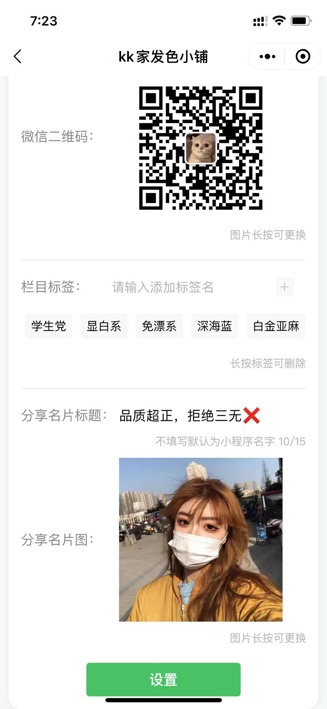
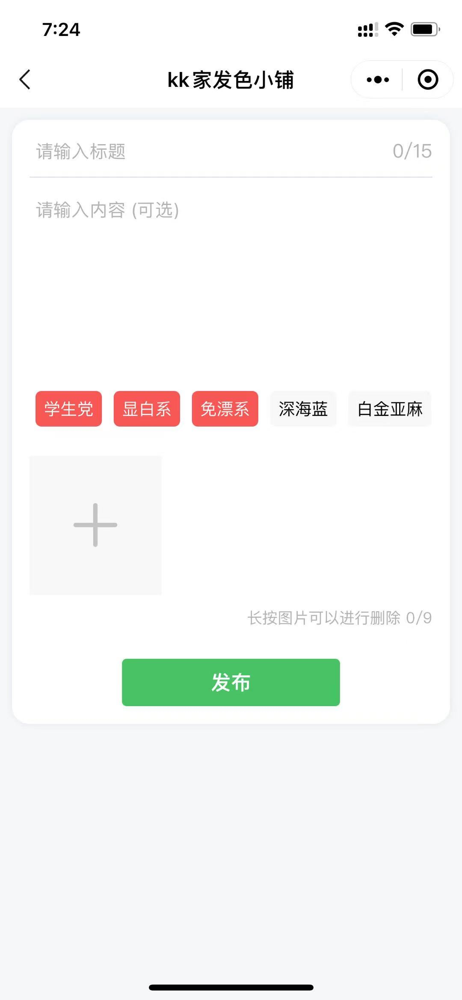

# 微信微商商展小程序
## 项目说明
微信小程序：一个可以当小橱窗使用的展示类小程序，基于云开发无需配置任何服务器和域名，后台在小程序端即可访问。
## 目录结构
- pages/admin 后台页面
- pages/index 首页
- pages/show 展示页
## 项目截图

## How to start

> 测试appid没有云开发，所以需要自行开通微信小程序

1. 开通微信小程序云开发功能，并且创建一个云数据库，手动创建**base**、**share_logs**、**show**、**view_logs**集合，导入**db**目录里的json文件到**base**集合

2. 使用**微信开发者工具**导入项目，选择当前项目根目录，选择打开，绑定**appid**打开，修改**app.js**里面改成自己的云数据库
